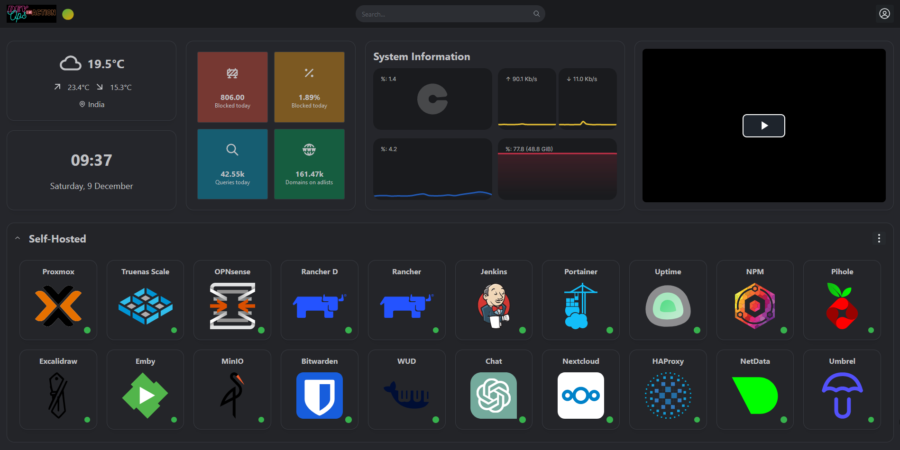

# 🎪 About My Homelab
🏡 Small Homelab for 2023! 💻

Hey folks! 👋 I am excited to give you a sneak peek into my Homelab setup! 🤓 
🚀 As a DevOps engineer we need a lab where we can deploy & test our microservices/applications. Here is my home lab. Nothing special but mine.



# 🖌️ Hardware Details

```
🟢 Server:
        ➺ Dell Precision T5810:
                CPU: Xeon E-2673 v3 12Core/24Thread CPU
                Memory: 64GB DDR3-1600
                Storage: (500 SSD Boot Drive + 500 SSD + 2 TB HDD)
                GPU: Nvidia Quadro K-2200 4GB Graphics 
                OS: Proxmox 
🟢 Personal System
        ➺ Desktop PC has the below config:
                CPU: AMD Ryzen 7 5800X 3.8 GHz
                Motherboard: ASUS B550 Prime B550M-A WiFi II
                Memory: Corsair 8x4 32GB DDR4 Ram
                Storage: (1TB SSD + 1 TB HDD)
                Cabinet: Ant Esports 690 Air
                OS: Windows 10
                Monitor: Dell 
                Keyboard: TVS Gold
                Mouse: Logitech M235
                Alexa Echo Dot (3rd Gen)
🟢 Laptop:
        ➺ Dell Latitude 5490 (i7 CPU, 16GB Memory, 500GB SSD)

🟢 Router: 
        ➺ TPLink is for Fiber Connectivity & Netgear for LAN
```

# 📌 Services, which I'm using in my Lab:

🤓 Services, that I am using for DevOps daily operation.
| Service Name | Description |
|--------------|-------------|
|✅Proxmox | Proxmox Virtual Environment is a hyper-converged infrastructure open-source software. It is a hosted hypervisor that can run operating systems including Linux and Windows on x64 hardware.|
|✅Linux OS | Ubuntu, CentOS, Debian, Alpine |
|✅Database Host | Database(MySQL, Postgres, MongoDB) hosted for some personal tasks and testing purposes |
|✅Kubernetes|Kubernetes is an open-source container orchestration system for automating software deployment, scaling, and management. Originally designed by Google, the project is now maintained by the Cloud Native Computing Foundation. |
|✅TrueNAS|TrueNAS is the branding for a range of free and open-source network-attached storage operating systems produced by iXsystems, and based on FreeBSD and Linux, using the OpenZFS file system.|
|✅OPNsense|OPNsense is an open-source, FreeBSD-based firewall and routing software developed by Deciso, a company in the Netherlands that makes hardware and sells support packages for OPNsense. It is a fork of pfSense, which in turn was forked from m0n0wall built on FreeBSD.|
|✅Rancher|Rancher, the open-source multi-cluster orchestration platform, lets operations teams deploy, manage and secure enterprise Kubernetes. |
|✅Jenkins|Jenkins is an open-source automation server. It helps automate the parts of software development related to building, testing, and deploying, facilitating continuous integration, and continuous delivery.|
|✅Portainer|Portainer is your container management software to deploy, troubleshoot, and secure applications across cloud, data center, and Industrial IoT use cases.|
|✅Uptime Kuma|Uptime Kuma. Uptime Kuma is an easy-to-use self-hosted monitoring tool. |
|✅Nginx & Nginx proxy manager|We are using it to access our microservices|
|✅Pihole|Pi-hole is a Linux network-level advertisement and Internet tracker blocking application that acts as a DNS sinkhole and optionally a DHCP server, intended for use on a private network.|
|✅Excalidraw|Excalidraw is a virtual collaborative whiteboard tool that lets you easily sketch diagrams that have a hand-drawn feel to them|
|✅Emby|Emby is a media server designed to organize, play, and stream audio and video to a variety of devices.|
|✅MINIO SERVER|MinIO® is an object storage server, compatible with Amazon S3 cloud storage service, mainly used for storing unstructured data (such as photos, videos, log files, etc.).|
|✅Bitwarden|Bitwarden is a freemium open-source password management service that stores sensitive information such as website credentials in an encrypted vault. The platform offers a variety of client applications including a web interface, desktop applications, browser extensions, mobile apps, and a command-line|
|✅What's-up docker (WUD)|Gets you notified when new versions of your Docker containers are available and lets you react the way you want.|
|✅Nextcloud|Nextcloud is a suite of client-server software for creating and using file hosting services. Nextcloud provides functionality similar to Dropbox, Office 365 or Google Drive when used with integrated office suites Collabora Online or OnlyOffice.|
|✅HAProxy|HAProxy is a free and open-source software that provides a high availability load balancer and reverse proxy for TCP and HTTP-based applications that spreads requests across multiple servers.|
|✅Netdata|Netdata is a distributed real-time, health monitoring platform for systems, hardware, containers & applications, collecting metrics.|
|✅Umbrel|A beautiful home server OS for self-hosting with an app store. Buy a pre-built Umbrel Home with umbrelOS|

### Connect with me 👇👇

- 🔥 [**Youtube**](https://www.youtube.com/@DevOpsinAction?sub_confirmation=1)
- ✍ [**Blog**](https://ibraransari.blogspot.com/)
- 💼 [**LinkedIn**](https://www.linkedin.com/in/ansariibrar/)
- 👨‍💻 [**Github**](https://github.com/meibraransari?tab=repositories)
- 💬 [**Telegram**](https://t.me/DevOpsinActionTelegram)


